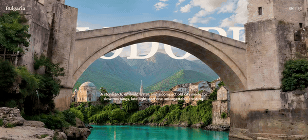

<h1 align="center">The Wonderful Bridges</h1>

<p align="center">
  A cinematic, scroll-driven web story of the <strong>Wonderful Bridges</strong> (Чудните мостове) —
  a marble rock phenomenon in Bulgaria's Western Rhodopes.<br/>
  Built in <strong>vanilla HTML, CSS &amp; JavaScript</strong> — no frameworks, no build step.
</p>

<p align="center">
  
  
  
  
  
</p>

<p align="center">
  
</p>

---

Scroll is the only control. A single sticky **stage** stays pinned while the whole scene —
sky, bridge, river, town — reacts to your scroll position and mouse, resolving into two story
panels about the Wonderful Bridges. Fully bilingual, GPU-smooth, and framework-free.

## ✨ Highlights

- **Scroll-driven cinema** — one pinned stage; the entire story is scrubbed across ~2500px.
- **Smooth by design** — a single `requestAnimationFrame` loop writes CSS custom properties; the browser composites `transform` / `opacity` / `filter` on the GPU, with zero per-frame layout work.
- **Bilingual 🇬🇧 / 🇧🇬** — one click flips the whole page between English and Bulgarian, and the choice is remembered.
- **Pointer parallax** — every layer drifts subtly with the cursor.
- **Motion-safe** — honours `prefers-reduced-motion`.
- **Zero dependencies** — three files. No framework, no bundler, no `npm install`.

## 🛠 Built with

`HTML5` · `CSS3` (custom properties · `position: sticky` · `clamp()`) · `Vanilla JavaScript` (`requestAnimationFrame` · `lerp` · `smoothstep`)

## ⚙️ How it works

The whole scene is a `position: sticky` stage pinned inside a tall (`100vh + 2500px`) section.
A single `requestAnimationFrame` loop reads the scroll offset, smooths it with `lerp` inertia,
and writes a set of CSS custom properties. The stylesheet binds those variables to GPU-friendly
`transform` / `opacity` / `filter` values, so the browser composites the animation without any
per-frame layout work — and the loop halts itself when nothing is moving, so it costs nothing at rest.

## 🎬 Choreography (scrubbed across ~2500px)

| Scroll | What happens |
|---|---|
| **0–650px** | The title rises and fades; the intro line sinks away. |
| **560–1620px** | The bridge widens and launches upward, the frame splits apart, a river close-up fades in behind a blue veil + blur, and the first story panel appears. |
| **1760–2500px** | The scene gains saturation and the second panel fades in with a *Learn more* link — where the scroll comes to rest. |

Pointer movement adds a subtle parallax to every layer.

## 🚀 Run it locally

No build, no install — just serve the folder with any static server:

```bash
git clone https://github.com/Niko5886/wonderful-bridges.git
cd wonderful-bridges
python -m http.server 5500
# then open http://localhost:5500
```

Scroll slowly to scrub the story; move the mouse for parallax; toggle **EN | BG** in the header.

## 📁 Structure

```
index.html   → DOM structure & copy (data-i18n keys)
styles.css   → :root variables, layered scene, UI, media queries
script.js    → scroll-driven animation engine + EN/BG i18n
fonts/       → local Ogg Medium woff2
assets/      → demo GIF
```

## ♿ Accessibility &amp; notes

- `prefers-reduced-motion` disables scroll smoothing and pointer parallax.
- Language is reflected on `<html lang>` and toggled with `aria-pressed` buttons.
- **Assets:** scene photography and icons load from their original remote hosts, so an internet connection is required.
- **Font (Ogg Medium):** served from a local `fonts/` copy — the original CloudFront URL sends no `Access-Control-Allow-Origin` header, and browsers require CORS for web fonts, so the cross-origin `@font-face` fails and would silently fall back to a system serif. The local copy renders it reliably.

## 👤 Author

**Nikolay Stoyanov** — AI-native Full-Stack Developer
[GitHub](https://github.com/Niko5886) · [LinkedIn](https://www.linkedin.com/in/nikolay-stoyanov-dev)

## 📄 License

[MIT](LICENSE) © 2026 Nikolay Stoyanov
